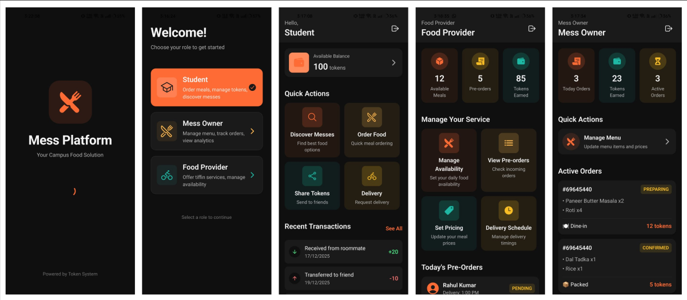

# Centralized Mess Solution (MessPlatform)

**Short:** I wanted to check if I was "handy" with development — so I built MessPlatform to digitize college messes. Think: menus, tokens, orders, delivery — all centralized (and less chaotic).

## Problems We Faced — What the App Fixes

- **Students bored of one mess** → discovery + rotating/weekly specials.
- **Money wasted when students miss meals** → prepaid tokens/credits + easy pauses/refunds.
- **Meals missed on exam/contest days** → schedule pauses & flexible cancellations.
- **Small tiffin businesses lack visibility** → vendor listings & provider dashboard.
- **Some students can't visit the mess** → delivery & pickup scheduling.
- **Students can't customize meals** → meal customization, add-ons & saved prefs.
- **Mess owners struggle with cash & disputes** → in-app payments, token ledger & receipts.
- **Freshers don't know which mess is good** → menus + simple ratings & quick reviews.
- **Diet needs are not supported** → dietary tags/filters and preference support.
- **Food is wasted due to poor demand planning** → pre-order counts & simple forecasts.
- **Leftover food goes to waste** → surplus alerts, discounted leftover sales or donation coordination.

## Highlights

- Centralized menus and discovery
- Token wallet for cashless payments
- Provider dashboard for small vendors
- Delivery scheduling and order tracking
- Meal customization and dietary support
- Simple analytics for demand planning

## Tech Stack

- React Native + TypeScript
- Context API for state management
- Expo for cross-platform development

---

Want screenshots, the repo link, or a quick demo? Check the code in this repo or reach out!
